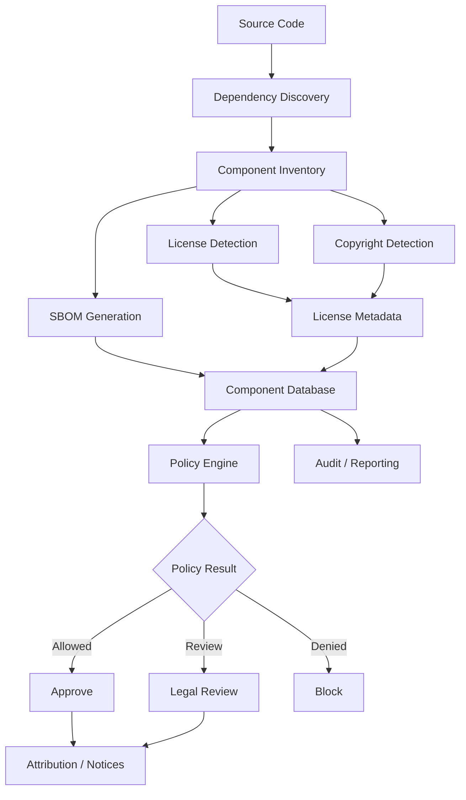
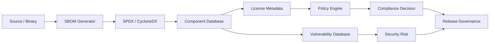
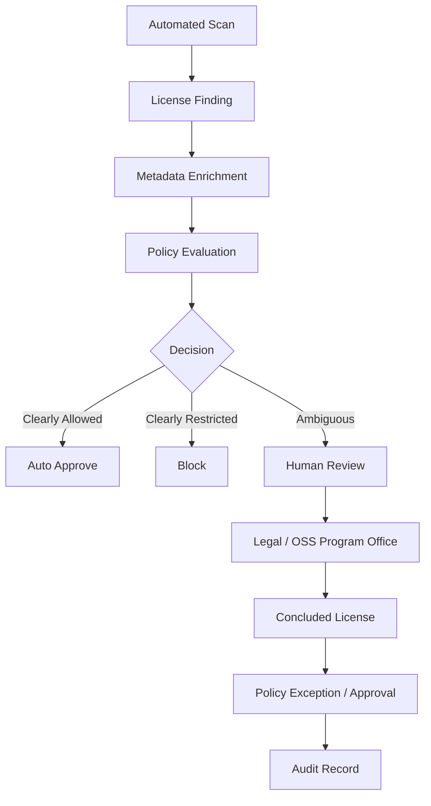
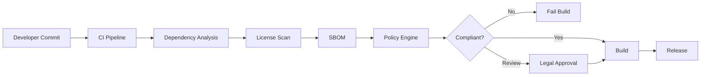

# Awesome-License-Compliance-Platform

# ⚖️ Top License Compliance Platforms & Open-Source License Compliance


> A curated list of **software license compliance platforms, open-source governance tools, license scanners, SBOM tools, FOSS compliance systems and open-source alternatives** for managing third-party software licensing risk.


Modern software is assembled from thousands of open-source and third-party components. License compliance platforms help organizations discover those components, identify their licenses, understand obligations, enforce policies and generate attribution / disclosure documentation.


This repository focuses primarily on **open-source and self-hostable license compliance software**, while maintaining a separate list of commercial platforms such as FOSSA, Black Duck, Mend, JFrog Xray, Sonatype Lifecycle, Snyk License, Protecode, ScanCode Enterprise, ClearlyDefined and Palamida.


A modern license compliance architecture typically combines:


```text

Source Code

    +

Dependency Analysis

    +

License Detection

    +

Copyright Detection

    +

SBOM

    +

License Metadata

    +

Policy Engine

    +

Obligation Analysis

    +

Attribution / Notices

    +

Legal Review

    =

Software License Compliance

```


> **Important:** License compliance is broader than vulnerability scanning. A strong program needs component discovery, license identification, license expressions, obligations, policy decisions, provenance, SBOMs and human/legal review.


---


## 📑 Table of Contents


* [☁️ SaaS/Hosted Platforms](#️-saashosted-platforms)

* [🌍 Open-Source](#-open-source)

* [🔍 Open-Source License Scanners](#-open-source-license-scanners)

* [🏢 Open-Source FOSS Compliance Platforms](#-open-source-foss-compliance-platforms)

* [📦 Open-Source Software Composition Analysis](#-open-source-software-composition-analysis)

* [📋 Open-Source SBOM Tools](#-open-source-sbom-tools)

* [⚖️ Open-Source License Policy & Compliance](#️-open-source-license-policy--compliance)

* [🧾 Open-Source Attribution & Notice Generation](#-open-source-attribution--notice-generation)

* [🗂️ Open-Source License Databases](#️-open-source-license-databases)

* [🔗 Open-Source Component Catalogs](#-open-source-component-catalogs)

* [🧬 Open-Source Dependency Analysis](#-open-source-dependency-analysis)

* [🔐 Open-Source Supply Chain Scanners](#-open-source-supply-chain-scanners)

* [💻 Language-Specific License Compliance](#-language-specific-license-compliance)

* [🧩 Commercial Platform → Open-Source Equivalent](#-commercial-platform--open-source-equivalent)

* [🏗️ License Compliance Architecture](#️-license-compliance-architecture)

* [🔄 Open-Source License Compliance Pipeline](#-open-source-license-compliance-pipeline)

* [📦 SBOM → License Compliance Architecture](#-sbom--license-compliance-architecture)

* [⚖️ Commercial vs Open-Source](#️-commercial-vs-open-source)

* [🚀 Recommended Open-Source Stacks](#-recommended-open-source-stacks)

* [📊 License Compliance Technology Comparison](#-license-compliance-technology-comparison)

* [🎯 Recommended Projects by Use Case](#-recommended-projects-by-use-case)

* [🏢 Building a FOSSA Alternative](#-building-a-fossa-alternative)

* [🏭 Building an Enterprise OSS Compliance Platform](#-building-an-enterprise-oss-compliance-platform)

* [🌐 Open-Source License Compliance Landscape](#-open-source-license-compliance-landscape)

* [🧠 Why Open-Source License Compliance Matters](#-why-open-source-license-compliance-matters)

* [🤝 Contributing](#-contributing)

* [⚠️ Disclaimer](#️-disclaimer)


---


# ☁️ SaaS/Hosted Platforms


Commercial license compliance platforms combine software composition analysis, license intelligence, policy management, SBOMs, vulnerability management and enterprise workflows.


| Platform                                                                                 | Company                    | Primary Focus              | Key Capabilities                                                     |

| ---------------------------------------------------------------------------------------- | -------------------------- | -------------------------- | -------------------------------------------------------------------- |

| [FOSSA](https://fossa.com/)                                                              | FOSSA                      | Open-source compliance     | License detection, policies, attribution, SBOMs, dependency analysis |

| [Black Duck](https://www.blackduck.com/)                                                 | Black Duck / Synopsys      | Enterprise SCA             | License compliance, vulnerability management, snippet analysis, SBOM |

| [Mend](https://www.mend.io/)                                                             | Mend                       | Application security / SCA | Open-source governance, license compliance, dependency analysis      |

| [JFrog Xray](https://jfrog.com/xray/)                                                    | JFrog                      | Software supply chain      | Binary analysis, license policies, vulnerabilities, artifacts        |

| [Sonatype Lifecycle](https://www.sonatype.com/products/sonatype-lifecycle)               | Sonatype                   | Component governance       | License policy, dependency intelligence, SCA                         |

| [Snyk License Compliance](https://snyk.io/)                                              | Snyk                       | Developer security         | Open-source licenses, dependencies, vulnerabilities, policy          |

| [Protecode](https://www.protecode.com/)                                                  | Protecode                  | OSS compliance             | License analysis, SBOM and software composition                      |

| [ScanCode Enterprise](https://www.aboutcode.org/)                                        | AboutCode                  | Software composition       | License/copyright detection, SBOM, provenance and compliance         |

| [ClearlyDefined](https://clearlydefined.io/)                                             | ClearlyDefined / community | License metadata           | Curated license and component metadata                               |

| [Palamida](https://www.palamida.com/)                                                    | Palamida                   | OSS governance             | Open-source discovery, license compliance and governance             |

| [FOSSOLOGY Enterprise Services](https://www.fossology.org/)                              | FOSSology ecosystem        | FOSS compliance            | License scanning and compliance workflows                            |

| [Mend Renovate](https://www.mend.io/renovate/)                                           | Mend                       | Dependency management      | Dependency discovery and upgrade automation                          |

| [Revenera Code Insight](https://www.revenera.com/products/software-composition-analysis) | Revenera                   | OSS compliance             | License analysis, component identification and SBOM                  |

| [Flexera One](https://www.flexera.com/)                                                  | Flexera                    | Software asset management  | Software inventory and license governance                            |

| [Anchore Enterprise](https://anchore.com/)                                               | Anchore                    | Container / SBOM security  | SBOM, policy, vulnerabilities and license controls                   |

| [Scribe](https://scribesecurity.com/)                                                    | Scribe Security            | Software supply chain      | SBOM, provenance, policy and supply-chain governance                 |

| [Endor Labs](https://www.endorlabs.com/)                                                 | Endor Labs                 | SCA                        | Dependency intelligence, OSS risk and governance                     |

| [Legit Security](https://www.legitsecurity.com/)                                         | Legit Security             | Software supply chain      | Application security and software supply-chain governance            |


---


# 🌍 Open-Source


The open-source ecosystem is considerably broader than a single "FOSSA replacement".


A complete self-hosted solution can combine:


```text

              OPEN-SOURCE LICENSE COMPLIANCE

                           │

       ┌───────────────────┼───────────────────┐

       │                   │                   │

       ▼                   ▼                   ▼

 License Scanning       SBOM / SCA          Policy

       │                   │                   │

       ▼                   ▼                   ▼

  ScanCode             Syft / Trivy          ORT

  FOSSology            CycloneDX             REUSE

  Licensee             SPDX                  SW360

       │                   │                   │

       └───────────────────┼───────────────────┘

                           │

                           ▼

                  Component Intelligence

                           │

                           ▼

                    Legal / Engineering

```


---


# 🔍 Open-Source License Scanners


These tools focus primarily on detecting licenses, copyrights and licensing information in source code, binaries or dependencies.


| Project                                                               | Primary Capability                            | License           |

| --------------------------------------------------------------------- | --------------------------------------------- | ----------------- |

| [ScanCode Toolkit](https://github.com/aboutcode-org/scancode-toolkit) | License + copyright + package detection       | Apache-2.0        |

| [FOSSology](https://github.com/fossology/fossology)                   | License / copyright / export-control scanning | GPL-2.0           |

| [Licensee](https://github.com/licensee/licensee)                      | Detect repository license                     | MIT               |

| [licensecheck](https://github.com/FOSSology/licensecheck)             | License detection                             | GPL-2.0           |

| [go-license-detector](https://github.com/elastic/go-elasticsearch)    | Go license detection ecosystem                | Project-dependent |

| [Ninka](https://github.com/dmgerman/ninka)                            | License identification                        | GPL               |

| [AskALicense](https://github.com/benbalter/askalicense)               | License identification / metadata             | MIT               |

| [REUSE](https://github.com/fsfe/reuse-tool)                           | License / copyright compliance                | GPL-3.0           |

| [SPDX License List](https://github.com/spdx/license-list-data)        | Canonical license metadata                    | CC0-1.0           |


ScanCode Toolkit detects licenses, copyrights, package manifests, dependencies and related metadata from source and binary files and can emit SPDX, CycloneDX and other structured formats. ([github.com](https://github.com/aboutcode-org/scancode-toolkit?utm_source=chatgpt.com))


FOSSology provides both a command-line toolkit and a database/web application for license, copyright and export-control scanning and compliance workflows. ([github.com](https://github.com/fossology/fossology?utm_source=chatgpt.com))


---


# 🏢 Open-Source FOSS Compliance Platforms


## FOSSology


[FOSSology](https://github.com/fossology/fossology) is one of the most complete open-source platforms specifically dedicated to FOSS license compliance.


It provides:


* License scanning

* Copyright scanning

* Export-control scanning

* Web UI

* Database-backed workflow

* License review

* SPDX output

* Attribution / notice generation

* CLI tooling

* REST API capabilities


```text

                     Source / Binary

                           │

                           ▼

                       FOSSology

                           │

              ┌────────────┼────────────┐

              ▼            ▼            ▼

          Licenses     Copyrights   Metadata

              │            │            │

              └────────────┼────────────┘

                           ▼

                     Review Workflow

                           │

                           ▼

                       SPDX / Notice

```


FOSSology is licensed primarily under GPL-2.0, with LGPL-2.1 exceptions for specified libraries. ([github.com](https://github.com/fossology/fossology?utm_source=chatgpt.com))


---


## SW360


[SW360](https://github.com/eclipse-sw360/sw360) is an open-source software component catalog and license-management platform.


It provides:


* Component cataloging

* Project/product management

* License information

* SPDX support

* REST API

* Vulnerability-related component management

* Obligation management

* Enterprise workflows


```text

Projects

   │

   ▼

SW360

   │

   ├── Components

   ├── Licenses

   ├── Projects

   ├── Vendors

   ├── SPDX

   └── Obligations

```


SW360 is an Eclipse project licensed under EPL-2.0. ([github.com](https://github.com/eclipse-sw360/sw360?utm_source=chatgpt.com))


---


# 📦 Open-Source Software Composition Analysis


SCA tools identify the third-party components and dependencies contained within a software project.


| Project                                                                 | Dependency Analysis | License Analysis | SBOM | Vulnerabilities |

| ----------------------------------------------------------------------- | :-----------------: | :--------------: | :--: | :-------------: |

| [OSS Review Toolkit](https://github.com/oss-review-toolkit/ort)         |          ✅          |         ✅        |   ✅  |        ✅        |

| [ScanCode Toolkit](https://github.com/aboutcode-org/scancode-toolkit)   |          ✅          |         ✅        |   ✅  |        ⚠️       |

| [ScanCode.io](https://github.com/aboutcode-org/scancode.io)             |          ✅          |         ✅        |   ✅  |        ✅        |

| [Syft](https://github.com/anchore/syft)                                 |          ✅          |        ⚠️        |   ✅  |        ❌        |

| [Trivy](https://github.com/aquasecurity/trivy)                          |          ✅          |         ✅        |   ✅  |        ✅        |

| [Dependency-Track](https://github.com/DependencyTrack/dependency-track) |          ⚠️         |        ⚠️        |   ✅  |        ✅        |

| [FOSSology](https://github.com/fossology/fossology)                     |          ⚠️         |         ✅        |   ✅  |        ⚠️       |

| [SW360](https://github.com/eclipse-sw360/sw360)                         |          ⚠️         |         ✅        |   ✅  |        ✅        |

| [Grype](https://github.com/anchore/grype)                               |          ✅          |         ❌        |  ⚠️  |        ✅        |

| [OSV-Scanner](https://github.com/google/osv-scanner)                    |          ✅          |         ❌        |  ⚠️  |        ✅        |


---


# 🔬 OSS Review Toolkit


[OSS Review Toolkit (ORT)](https://github.com/oss-review-toolkit/ort) is one of the most comprehensive open-source frameworks for automating FOSS compliance.


Its pipeline can include:


```text

Analyzer

   │

   ▼

Dependency Graph

   │

   ▼

Downloader

   │

   ▼

Scanner

   │

   ▼

Evaluator

   │

   ▼

Reporter

```


ORT can:


* Analyze dependencies

* Download source packages

* Scan source code

* Identify licenses

* Apply license policies

* Generate SPDX / CycloneDX SBOMs

* Generate attribution documents

* Apply policy-as-code

* Curate package metadata

* Integrate with CI/CD


ORT explicitly supports policy automation, license checks, SBOM generation and FOSS attribution documentation. ([github.com](https://github.com/oss-review-toolkit/ort?utm_source=chatgpt.com))


---


# 🧪 ScanCode.io


[ScanCode.io](https://github.com/aboutcode-org/scancode.io) provides a server-based framework for scripting and automating software composition analysis through pipelines.


It is particularly useful when you want to build a custom compliance workflow around ScanCode.


```text

Input

 │

 ├── Git Repository

 ├── Source Archive

 ├── Package

 ├── Container

 └── Binary

 │

 ▼

ScanCode.io Pipeline

 │

 ├── Package Discovery

 ├── License Detection

 ├── Copyright Detection

 ├── Dependency Analysis

 └── SBOM

 │

 ▼

JSON / SPDX / CycloneDX

```


ScanCode.io is Apache-2.0 licensed. ([github.com](https://github.com/aboutcode-org/scancode.io?utm_source=chatgpt.com))


---


# 📋 Open-Source SBOM Tools


SBOMs are a critical intermediate layer between software inventory and license compliance.


## SPDX


[SPDX](https://spdx.dev/) provides a standardized format and ecosystem for representing software package, license and relationship information.


Useful projects include:


| Project                                                                          | Role                |

| -------------------------------------------------------------------------------- | ------------------- |

| [SPDX Tools](https://github.com/spdx/tools)                                      | SPDX tooling        |

| [SPDX License List](https://github.com/spdx/license-list-data)                   | License metadata    |

| [spdx-sbom-generator](https://github.com/opensbom-generator/spdx-sbom-generator) | SBOM generation     |

| [SPDX Java Tools](https://github.com/spdx/spdx-java)                             | Java SPDX libraries |

| [SPDX Python Tools](https://github.com/spdx/tools-python)                        | Python SPDX tooling |

| [SPDX Go Tools](https://github.com/spdx/tools-golang)                            | Go SPDX tooling     |


---


## CycloneDX


[CycloneDX](https://cyclonedx.org/) is another major SBOM standard.


| Project                                                                  | Role                |

| ------------------------------------------------------------------------ | ------------------- |

| [CycloneDX CLI](https://github.com/CycloneDX/cyclonedx-cli)              | SBOM manipulation   |

| [CycloneDX Python](https://github.com/CycloneDX/cyclonedx-python-lib)    | Python SBOM library |

| [CycloneDX Maven](https://github.com/CycloneDX/cyclonedx-maven-plugin)   | Maven SBOM          |

| [CycloneDX Gradle](https://github.com/CycloneDX/cyclonedx-gradle-plugin) | Gradle SBOM         |

| [CycloneDX Node](https://github.com/CycloneDX/cyclonedx-node-npm)        | Node.js SBOM        |

| [CycloneDX Go](https://github.com/CycloneDX/cyclonedx-go)                | Go SBOM library     |


---


# 🧾 Open-Source Attribution & Notice Generation


A major requirement of license compliance is generating notices and attribution documents.


Useful projects include:


| Project                                                                  | Capability                         |

| ------------------------------------------------------------------------ | ---------------------------------- |

| [ORT](https://github.com/oss-review-toolkit/ort)                         | Attribution / disclosure documents |

| [FOSSology](https://github.com/fossology/fossology)                      | License reports and notices        |

| [ScanCode Toolkit](https://github.com/aboutcode-org/scancode-toolkit)    | Attribution generation             |

| [ScanCode.io](https://github.com/aboutcode-org/scancode.io)              | Automated attribution pipelines    |

| [REUSE](https://github.com/fsfe/reuse-tool)                              | License and copyright metadata     |

| [SW360](https://github.com/eclipse-sw360/sw360)                          | Component/license governance       |

| [license-maven-plugin](https://github.com/mojohaus/license-maven-plugin) | Maven license reports              |


---


# ⚖️ Open-Source License Policy & Compliance


License detection answers:


> **"What license is this component using?"**


Policy engines answer:


> **"Are we allowed to use this component under our organization's rules?"**


Typical policies:


```text

MIT                 → ALLOW

BSD-2-Clause        → ALLOW

Apache-2.0          → ALLOW

MPL-2.0             → REVIEW

LGPL-2.1            → REVIEW

LGPL-3.0            → REVIEW

GPL-2.0              → REVIEW / RESTRICT

GPL-3.0              → RESTRICT

AGPL-3.0             → RESTRICT

Unknown              → BLOCK / REVIEW

Custom License       → LEGAL REVIEW

```


Open-source policy tooling:


| Project                                                                 | Policy Capabilities             |

| ----------------------------------------------------------------------- | ------------------------------- |

| [ORT](https://github.com/oss-review-toolkit/ort)                        | Policy-as-code                  |

| [REUSE](https://github.com/fsfe/reuse-tool)                             | Repository compliance           |

| [SW360](https://github.com/eclipse-sw360/sw360)                         | License / obligation management |

| [FOSSology](https://github.com/fossology/fossology)                     | License review workflows        |

| [Dependency-Track](https://github.com/DependencyTrack/dependency-track) | Component policy / risk         |

| [Trivy](https://github.com/aquasecurity/trivy)                          | License scanning and policy     |

| [Conftest](https://github.com/open-policy-agent/conftest)               | Policy-as-code                  |

| [Open Policy Agent](https://github.com/open-policy-agent/opa)           | General policy engine           |


---


# 🗂️ Open-Source License Databases


License intelligence is one of the most important pieces of a compliance platform.


## ScanCode LicenseDB


[ScanCode LicenseDB](https://github.com/aboutcode-org/scancode-licensedb) is a large open database of software licenses and license metadata.


It contains:


* License texts

* SPDX identifiers

* OSI identifiers

* License metadata

* License classifications

* License families

* Curated license information


The project describes LicenseDB as a reusable reference resource for license compliance and SBOM tooling. ([github.com](https://github.com/aboutcode-org/scancode-licensedb?utm_source=chatgpt.com))


---


## SPDX License List


[SPDX License List](https://github.com/spdx/license-list-data) provides standardized identifiers and metadata for commonly recognized software licenses.


Useful for:


* License normalization

* SBOMs

* Compliance policies

* License expressions

* Automated matching


---


## ClearlyDefined


[ClearlyDefined](https://github.com/clearlydefined/clearlydefined) is an open community project focused on improving license and component metadata for open-source software.


Conceptually:


```text

Package

   │

   ▼

Declared Metadata

   │

   ▼

ClearlyDefined

   │

   ├── License

   ├── Copyright

   ├── Source

   ├── Attribution

   └── Curations

```


This makes ClearlyDefined particularly useful as a **metadata enrichment layer** rather than a complete enterprise compliance platform.


---


# 🔗 Open-Source Component Catalogs


| Project                                                                   | Description                                |

| ------------------------------------------------------------------------- | ------------------------------------------ |

| [SW360](https://github.com/eclipse-sw360/sw360)                           | Enterprise software component catalog      |

| [ClearlyDefined](https://github.com/clearlydefined/clearlydefined)        | Open component/license metadata            |

| [ScanCode LicenseDB](https://github.com/aboutcode-org/scancode-licensedb) | License database                           |

| [ORT Config](https://github.com/oss-review-toolkit/ort-config)            | Package curations and policy configuration |

| [Dependency-Track](https://github.com/DependencyTrack/dependency-track)   | SBOM/component intelligence                |

| [SPDX License List](https://github.com/spdx/license-list-data)            | Standard license catalog                   |


---


# 🧬 Open-Source Dependency Analysis


Different ecosystems require different dependency discovery mechanisms.


| Ecosystem        | Open-Source Tools                                 |

| ---------------- | ------------------------------------------------- |

| Java / Maven     | ORT, Maven, CycloneDX Maven, license-maven-plugin |

| Gradle           | ORT, CycloneDX Gradle                             |

| JavaScript / npm | ORT, Syft, Trivy, CycloneDX Node                  |

| Python           | ORT, Syft, Trivy, pip-licenses                    |

| Go               | ORT, Syft, Trivy, go-licenses                     |

| Rust             | cargo-about, cargo-deny, ORT                      |

| C / C++          | ScanCode, FOSSology, ORT                          |

| .NET             | ORT, Syft, Trivy                                  |

| PHP              | ORT, Syft, Composer ecosystem                     |

| Ruby             | ORT, Syft, LicenseFinder                          |

| Containers       | Syft, Trivy, ScanCode                             |

| OS packages      | Syft, Trivy, ORT                                  |

| Source archives  | ScanCode, FOSSology                               |

| Binary artifacts | ScanCode, FOSSology, Trivy                        |


---


# 💻 Language-Specific License Compliance


## Rust


| Tool                                                        | Purpose                     |

| ----------------------------------------------------------- | --------------------------- |

| [cargo-deny](https://github.com/EmbarkStudios/cargo-deny)   | License / dependency policy |

| [cargo-about](https://github.com/EmbarkStudios/cargo-about) | License attribution         |

| ORT                                                         | Enterprise OSS compliance   |


Example:


```text

cargo

  │

  ▼

cargo-deny

  │

  ├── License Checks

  ├── Dependency Checks

  ├── Source Checks

  └── Policy

```


---


## Python


Useful projects include:


* [pip-licenses](https://github.com/raimon49/pip-licenses)

* [pip-audit](https://github.com/pypa/pip-audit)

* ORT

* ScanCode

* Syft

* Trivy


---


## Java / Maven


Useful tools include:


* [license-maven-plugin](https://github.com/mojohaus/license-maven-plugin)

* CycloneDX Maven

* ORT

* ScanCode

* FOSSology


---


## JavaScript / Node.js


Useful tools include:


* ORT

* Syft

* Trivy

* CycloneDX Node

* npm dependency metadata

* ScanCode


---


# 🔐 Open-Source Supply Chain Scanners


License compliance increasingly overlaps with software supply-chain security.


| Project                                                                 |   License  | SBOM | Vulnerabilities | Licenses |

| ----------------------------------------------------------------------- | :--------: | :--: | :-------------: | :------: |

| [Trivy](https://github.com/aquasecurity/trivy)                          | Apache-2.0 |   ✅  |        ✅        |     ✅    |

| [Syft](https://github.com/anchore/syft)                                 | Apache-2.0 |   ✅  |        ❌        |    ⚠️    |

| [Grype](https://github.com/anchore/grype)                               | Apache-2.0 |  ⚠️  |        ✅        |     ❌    |

| [OSV-Scanner](https://github.com/google/osv-scanner)                    | Apache-2.0 |  ⚠️  |        ✅        |     ❌    |

| [Dependency-Track](https://github.com/DependencyTrack/dependency-track) | Apache-2.0 |   ✅  |        ✅        |    ⚠️    |

| [ORT](https://github.com/oss-review-toolkit/ort)                        | Apache-2.0 |   ✅  |        ✅        |     ✅    |

| [ScanCode](https://github.com/aboutcode-org/scancode-toolkit)           | Apache-2.0 |   ✅  |        ⚠️       |     ✅    |


---


# 🧩 Commercial Platform → Open-Source Equivalent


| Commercial Platform              | Open-Source Equivalent / Building Blocks      |

| -------------------------------- | --------------------------------------------- |

| **FOSSA**                        | ORT + ScanCode + FOSSology + SW360            |

| **Black Duck**                   | ScanCode + ORT + Dependency-Track + FOSSology |

| **Mend**                         | ORT + Trivy + ScanCode + Dependency-Track     |

| **JFrog Xray**                   | Trivy + Syft + ORT + Dependency-Track         |

| **Sonatype Lifecycle**           | ORT + Dependency-Track + SW360                |

| **Snyk License**                 | Trivy + ORT + ScanCode                        |

| **Protecode**                    | ScanCode + FOSSology + SBOM tooling           |

| **ScanCode Enterprise**          | ScanCode Toolkit + ScanCode.io + SW360        |

| **ClearlyDefined Enterprise**    | ClearlyDefined + ScanCode LicenseDB + ORT     |

| **Palamida**                     | FOSSology + SW360 + ORT + ScanCode            |

| **Enterprise OSS Compliance**    | ORT + ScanCode + FOSSology + SW360            |

| **License Scanner**              | ScanCode / FOSSology                          |

| **SBOM Compliance Platform**     | Syft + Dependency-Track + ORT                 |

| **License Policy Engine**        | ORT + OPA                                     |

| **Component Intelligence**       | SW360 + ClearlyDefined + ScanCode LicenseDB   |

| **Attribution Generator**        | ORT + ScanCode + FOSSology                    |

| **Container License Compliance** | Syft + Trivy + ORT                            |

| **CI License Gate**              | ORT + REUSE + Trivy                           |


---


# 🏗️ License Compliance Architecture





---


# 🔄 Open-Source License Compliance Pipeline


```text id="0i0nq8"

                    SOURCE CODE

                         │

                         ▼

                Dependency Analysis

                         │

                         ▼

                  Component Graph

                         │

             ┌───────────┼───────────┐

             ▼           ▼           ▼

          License     Copyright      SBOM

          Scanner      Scanner      Generator

             │           │           │

             └───────────┼───────────┘

                         ▼

                 Component Database

                         │

                         ▼

                  Metadata Enrichment

                         │

                         ▼

                    Policy Engine

                         │

             ┌───────────┼───────────┐

             ▼           ▼           ▼

          APPROVE      REVIEW       BLOCK

             │           │           │

             └───────────┼───────────┘

                         ▼

                Attribution / Notice

                         │

                         ▼

                     Release

```


---


# 📦 SBOM → License Compliance Architecture


SBOMs provide a useful abstraction layer between software builds and compliance systems.





A practical stack might be:


```text

Syft

  +

SPDX / CycloneDX

  +

ClearlyDefined / LicenseDB

  +

ORT

  +

Dependency-Track

  =

Open-Source Compliance Platform

```


---


# 🧑‍⚖️ Human-in-the-Loop Compliance


License automation should not be treated as a substitute for legal judgment.





---


# 🏭 Enterprise License Compliance Architecture


```text id="tq8m9j"

                         ENGINEERING

                              │

                              ▼

                         CI / CD

                              │

              ┌───────────────┼───────────────┐

              │               │               │

              ▼               ▼               ▼

          Dependency       License          SBOM

           Analysis        Scanner        Generator

              │               │               │

              └───────────────┼───────────────┘

                              ▼

                       Compliance Engine

                              │

                ┌─────────────┼─────────────┐

                ▼             ▼             ▼

             ORT          FOSSology       ScanCode

                │             │             │

                └─────────────┼─────────────┘

                              ▼

                      Component Catalog

                              │

                ┌─────────────┼─────────────┐

                ▼             ▼             ▼

             SW360       ClearlyDefined   LicenseDB

                │

                ▼

                       Policy Engine

                │

        ┌───────┼───────────┐

        ▼       ▼           ▼

      Allow   Review      Block

        │       │           │

        └───────┼───────────┘

                ▼

         Attribution / SBOM

                │

                ▼

             Release

```


---


# ⚖️ Commercial vs Open-Source


| Capability                        | Commercial Platform | Open-Source Stack              |

| --------------------------------- | ------------------- | ------------------------------ |

| License Detection                 | ✅                   | ✅                              |

| Copyright Detection               | ✅                   | ✅                              |

| Dependency Discovery              | ✅                   | ✅                              |

| SBOM                              | ✅                   | ✅                              |

| License Database                  | ✅                   | ✅                              |

| Policy Engine                     | ✅                   | ✅                              |

| License Obligations               | ✅                   | ✅                              |

| Attribution                       | ✅                   | ✅                              |

| Notice Generation                 | ✅                   | ✅                              |

| Component Catalog                 | ✅                   | ✅                              |

| Vulnerability Intelligence        | ✅                   | ✅                              |

| Enterprise Dashboard              | ✅                   | Build / integrate              |

| Legal Workflow                    | ✅                   | Build / integrate              |

| SSO                               | ✅                   | Build / integrate              |

| SaaS                              | ✅                   | ❌ Self-host                    |

| Self Hosting                      | Varies              | ✅                              |

| Air-Gapped Deployment             | Varies              | ✅                              |

| Source Code Access                | ❌                   | ✅                              |

| Custom Scanners                   | Limited             | ✅                              |

| Custom Policy                     | ✅                   | ✅                              |

| Custom Integrations               | ✅                   | ✅                              |

| Vendor Support                    | ✅                   | Community / commercial support |

| Data Ownership                    | Vendor-dependent    | Full control                   |

| Vendor Lock-In                    | Higher              | Lower                          |

| Deployment Complexity             | Lower               | Higher                         |

| Regulatory / Legal Responsibility | Shared / customer   | Customer                       |


---


# 📊 License Compliance Technology Comparison


| Project          | License Detection | SBOM | Policy | Component Catalog | Attribution |    UI   |

| ---------------- | :---------------: | :--: | :----: | :---------------: | :---------: | :-----: |

| FOSSology        |         ✅         |   ✅  |    ✅   |         ✅         |      ✅      |    ✅    |

| ScanCode Toolkit |         ✅         |   ✅  |   ⚠️   |         ⚠️        |      ✅      |    ❌    |

| ScanCode.io      |         ✅         |   ✅  |    ✅   |         ⚠️        |      ✅      |    ⚠️   |

| ORT              |         ✅         |   ✅  |    ✅   |         ⚠️        |      ✅      |    ⚠️   |

| SW360            |         ✅         |   ✅  |    ✅   |         ✅         |      ✅      |    ✅    |

| ClearlyDefined   |     ✅ Metadata    |  ⚠️  |   ⚠️   |         ✅         |      ⚠️     |    ✅    |

| LicenseDB        |         ✅         |   ❌  |    ❌   |         ✅         |      ❌      | Web/API |

| REUSE            |         ✅         |  ⚠️  |    ✅   |         ❌         |      ⚠️     |    ❌    |

| Syft             |         ⚠️        |   ✅  |    ❌   |         ❌         |      ❌      |    ❌    |

| Trivy            |         ✅         |   ✅  |    ✅   |         ⚠️        |      ❌      |    ❌    |

| Dependency-Track |         ⚠️        |   ✅  |    ✅   |         ✅         |      ❌      |    ✅    |

| Licensee         |         ✅         |   ❌  |    ❌   |         ❌         |      ❌      |    ❌    |

| SPDX Tools       |      Metadata     |   ✅  |    ❌   |         ❌         |      ⚠️     |    ❌    |

| CycloneDX Tools  |      Metadata     |   ✅  |    ❌   |         ❌         |      ⚠️     |    ❌    |


---


# 🎯 Recommended Projects by Use Case


| Use Case                                     | Recommended Starting Point             |

| -------------------------------------------- | -------------------------------------- |

| Full open-source license compliance platform | **FOSSology**                          |

| Enterprise OSS policy automation             | **ORT**                                |

| Deep license / copyright scanning            | **ScanCode Toolkit**                   |

| Automated ScanCode pipelines                 | **ScanCode.io**                        |

| Enterprise component catalog                 | **SW360**                              |

| License metadata enrichment                  | **ClearlyDefined**                     |

| License database                             | **ScanCode LicenseDB**                 |

| Repository license hygiene                   | **REUSE**                              |

| SBOM generation                              | **Syft**                               |

| SBOM + vulnerability + license scanning      | **Trivy**                              |

| SBOM lifecycle management                    | **Dependency-Track**                   |

| SPDX ecosystem                               | **SPDX Tools**                         |

| CycloneDX ecosystem                          | **CycloneDX Tools**                    |

| Fast repository license detection            | **Licensee**                           |

| Rust license policy                          | **cargo-deny**                         |

| Rust attribution                             | **cargo-about**                        |

| Maven license reporting                      | **license-maven-plugin**               |

| Container license compliance                 | **Syft + Trivy + ORT**                 |

| Enterprise legal review                      | **SW360 + FOSSology + ORT**            |

| Complete self-hosted stack                   | **ScanCode + ORT + SW360 + FOSSology** |


---


# 🏢 Building a FOSSA Alternative


A FOSSA-like open-source architecture can be constructed from:


```text id="5t8x6b"

                     Git Repository

                           │

                           ▼

                  Dependency Analyzer

                           │

                           ▼

                    Component Graph

                           │

             ┌─────────────┼─────────────┐

             ▼             ▼             ▼

         ScanCode        ORT           Syft

             │             │             │

             └─────────────┼─────────────┘

                           ▼

                  License Intelligence

                           │

             ┌─────────────┼─────────────┐

             ▼             ▼             ▼

        LicenseDB     ClearlyDefined    SPDX

                           │

                           ▼

                     Policy Engine

                           │

                           ▼

                         ORT

                           │

             ┌─────────────┼─────────────┐

             ▼             ▼             ▼

          APPROVE        REVIEW        BLOCK

             │             │             │

             └─────────────┼─────────────┘

                           ▼

                    Attribution Report

                           │

                           ▼

                         SBOM

```


---


# 🏭 Building an Enterprise OSS Compliance Platform


A larger architecture could use:


```text id="x0c9kv"

┌──────────────────────────────────────────────────────────┐

│                    DEVELOPER PORTAL                      │

└───────────────────────────┬──────────────────────────────┘

                            │

                            ▼

┌──────────────────────────────────────────────────────────┐

│                       API LAYER                          │

│                     REST / GraphQL                       │

└───────────────────────────┬──────────────────────────────┘

                            │

            ┌───────────────┼───────────────┐

            ▼               ▼               ▼

        Projects        Components        Policies

            │               │               │

            └───────────────┼───────────────┘

                            ▼

                    COMPONENT CATALOG

                            │

          ┌─────────────────┼─────────────────┐

          ▼                 ▼                 ▼

       SW360          ClearlyDefined      LicenseDB

          │                 │                 │

          └─────────────────┼─────────────────┘

                            ▼

                     ANALYSIS ENGINE

                            │

             ┌──────────────┼──────────────┐

             ▼              ▼              ▼

         ScanCode          ORT           Trivy

             │              │              │

             └──────────────┼──────────────┘

                            ▼

                     POLICY ENGINE

                            │

                ┌───────────┼───────────┐

                ▼           ▼           ▼

              PASS        REVIEW       FAIL

                │           │           │

                └───────────┼───────────┘

                            ▼

                  COMPLIANCE REPORTING

                            │

            ┌───────────────┼───────────────┐

            ▼               ▼               ▼

           SBOM         Attribution      Audit Log

```


---


# 🔄 CI/CD License Gate


License compliance can be integrated directly into the development pipeline.





Example:


```text id="d7f0cn"

git push

   │

   ▼

CI

   │

   ├── ORT analyze

   ├── ScanCode scan

   ├── Syft SBOM

   ├── ORT evaluate

   └── Generate notices

   │

   ▼

Policy Decision

   │

   ├── PASS

   ├── REVIEW

   └── FAIL

```


---


# 🌐 Open-Source License Compliance Landscape


```mermaid

mindmap

  root((OSS License Compliance))

    License Scanning

      ScanCode

      FOSSology

      Licensee

      Ninka

      REUSE

    Compliance Platforms

      FOSSology

      SW360

      ORT

      ScanCode.io

    SCA

      ORT

      Trivy

      Syft

      Dependency Track

      OSV Scanner

    SBOM

      SPDX

      CycloneDX

      Syft

      Trivy

    License Metadata

      ScanCode LicenseDB

      SPDX License List

      ClearlyDefined

    Policy

      ORT

      REUSE

      OPA

      Conftest

    Attribution

      ORT

      FOSSology

      ScanCode

      cargo-about

      license-maven-plugin

    Dependency Analysis

      ORT

      Syft

      Trivy

      Ecosystem Tools

    Enterprise

      SW360

      Dependency Track

      FOSSology

    Languages

      Java

      Python

      JavaScript

      Go

      Rust

      C/C++

      .NET

      PHP

      Ruby

```


---


# 🧠 Why Open-Source License Compliance Matters


Commercial platforms provide a highly integrated experience, but the underlying license-compliance problem can be decomposed into open-source components.


```text

Commercial Platform

       │

       ├── Discovery

       ├── License Detection

       ├── Metadata

       ├── SBOM

       ├── Policy

       ├── Attribution

       ├── Reporting

       └── Workflow


Open-Source Stack

       │

       ├── ScanCode

       ├── FOSSology

       ├── ORT

       ├── SW360

       ├── ClearlyDefined

       ├── LicenseDB

       ├── SPDX

       └── CycloneDX

```


The strongest reason to consider an open-source architecture is **composability**.


An organization can select different tools for:


* License detection

* Dependency discovery

* SBOM generation

* License metadata

* Policy enforcement

* Attribution

* Component cataloging

* Vulnerability analysis

* Legal review


rather than adopting one monolithic platform.


---


# 🧱 Recommended Open-Source Reference Architecture


For a serious enterprise implementation:


```text

                  SOURCE CODE / ARTIFACTS

                           │

                           ▼

                    ┌─────────────┐

                    │   ScanCode  │

                    └──────┬──────┘

                           │

             ┌─────────────┼─────────────┐

             ▼             ▼             ▼

         Licenses      Copyrights     Packages

             │             │             │

             └─────────────┼─────────────┘

                           ▼

                         ORT

                           │

                    Dependency Graph

                           │

                           ▼

                 ┌──────────────────┐

                 │ License Metadata │

                 └────────┬─────────┘

                          │

             ┌────────────┼────────────┐

             ▼            ▼            ▼

       ClearlyDefined  LicenseDB     SPDX

             │            │            │

             └────────────┼────────────┘

                          ▼

                    SW360 / Catalog

                          │

                          ▼

                    Policy Engine

                          │

             ┌────────────┼────────────┐

             ▼            ▼            ▼

          APPROVE       REVIEW        BLOCK

             │            │            │

             └────────────┼────────────┘

                          ▼

                 Attribution / SBOM

                          │

                          ▼

                        Release

```


---


# 🚀 Recommended Open-Source Stacks


## 🥇 1. Enterprise OSS Compliance


```text

ScanCode

+

ORT

+

SW360

+

ClearlyDefined

+

SPDX

+

CycloneDX

```


Best suited for organizations that need:


* Component inventory

* License scanning

* Policy automation

* SBOM

* Attribution

* Legal review

* Enterprise component governance


---


## ⚡ 2. Lightweight CI License Gate


```text

REUSE

+

ORT

+

Trivy

```


Useful when the main goal is:


* Pull-request checks

* License policy enforcement

* Dependency governance

* SBOM generation


---


## 🔬 3. Deep License Discovery


```text

ScanCode Toolkit

+

ScanCode LicenseDB

+

ClearlyDefined

+

SPDX

```


Best suited for:


* Source-code archives

* Binary analysis

* Third-party software audits

* License archaeology

* M&A due diligence


---


## 🏢 4. FOSSology-Centric Stack


```text

FOSSology

+

ScanCode

+

SPDX

+

SW360

```


Useful when organizations want a dedicated license-review workflow with a web UI.


---


## 📦 5. SBOM-Centric Compliance


```text

Syft

+

CycloneDX / SPDX

+

Dependency-Track

+

ORT

```


Useful when SBOMs are already the organization's primary software inventory format.


---


## 🐳 6. Container License Compliance


```text

Container Image

      │

      ▼

     Syft

      │

      ▼

   SBOM

      │

      ▼

    Trivy

      │

      ├── Vulnerabilities

      └── Licenses

      │

      ▼

    ORT

      │

      ▼

Policy Decision

```


---


# 🔥 Commercial → Open-Source Architecture


```text

FOSSA

  │

  ├── SCA              → ORT

  ├── License Scan     → ScanCode

  ├── Policy           → ORT / OPA

  ├── SBOM             → SPDX / CycloneDX

  └── Attribution      → ORT / ScanCode


Black Duck

  │

  ├── Component Scan   → ScanCode

  ├── License Scan     → FOSSology

  ├── SBOM             → Syft / SPDX

  ├── Policy           → ORT

  └── Catalog          → SW360


Mend

  │

  ├── Dependency       → ORT

  ├── License          → ScanCode

  ├── Vulnerability    → Trivy / OSV

  └── SBOM             → CycloneDX / SPDX


JFrog Xray

  │

  ├── Artifact Scan    → Syft / Trivy

  ├── License Scan     → ScanCode

  ├── Policy           → ORT

  └── SBOM             → SPDX / CycloneDX


Sonatype Lifecycle

  │

  ├── Dependency Graph → ORT

  ├── License Policy   → ORT

  ├── SBOM             → CycloneDX

  └── Catalog          → SW360


Snyk License

  │

  ├── Dependency Scan  → Trivy / ORT

  ├── License Scan     → ScanCode

  ├── Policy           → ORT

  └── SBOM             → SPDX / CycloneDX

```


---


# 🧠 License Compliance Layers


```text

┌──────────────────────────────────────────────┐

│              LEGAL / GOVERNANCE              │

│      Approvals • Exceptions • Audits         │

└───────────────────────┬──────────────────────┘

                        │

┌───────────────────────▼──────────────────────┐

│                 POLICY ENGINE                │

│       Allow • Review • Deny • Exceptions     │

└───────────────────────┬──────────────────────┘

                        │

┌───────────────────────▼──────────────────────┐

│             LICENSE INTELLIGENCE             │

│ SPDX • LicenseDB • ClearlyDefined             │

└───────────────────────┬──────────────────────┘

                        │

┌───────────────────────▼──────────────────────┐

│              COMPONENT CATALOG               │

│          SW360 • Dependency-Track            │

└───────────────────────┬──────────────────────┘

                        │

┌───────────────────────▼──────────────────────┐

│                 ANALYSIS                     │

│ ScanCode • FOSSology • ORT • Trivy • Syft    │

└───────────────────────┬──────────────────────┘

                        │

┌───────────────────────▼──────────────────────┐

│              SOURCE / ARTIFACTS               │

│ Git • Packages • Containers • Binaries        │

└──────────────────────────────────────────────┘

```


---


# 📚 Open-Source License Compliance Toolkit


A compact toolbox for engineering teams:


```text

License Detection

    → ScanCode


Compliance Workflow

    → FOSSology


Policy Automation

    → ORT


Component Catalog

    → SW360


License Metadata

    → ClearlyDefined / ScanCode LicenseDB


SBOM

    → SPDX / CycloneDX


SBOM Generation

    → Syft


Vulnerability + License Scan

    → Trivy


Repository License Hygiene

    → REUSE


Policy-as-Code

    → Open Policy Agent


Attribution

    → ORT / ScanCode


Container Analysis

    → Syft + Trivy

```


---


# 🤝 Contributing


Contributions are welcome!


Please consider adding:


* Open-source license scanners

* FOSS compliance platforms

* SCA tools

* SBOM generators

* License databases

* Component catalogs

* License policy engines

* Attribution generators

* Dependency analyzers

* Container scanners

* Binary analysis tools

* Copyright scanners

* SPDX tooling

* CycloneDX tooling

* License compatibility databases

* CI/CD integrations

* Legal-review workflows

* OSS governance platforms

* Enterprise compliance projects


When adding a project, clearly distinguish between:


* **Fully open-source**

* **Open-core**

* **Source available**

* **Community edition**

* **Hosted service**

* **Commercial enterprise product**

* **Open-source library / component**


Also verify the current license of both the **software and any bundled databases, model/data assets or third-party components**.


---


# ⚠️ Disclaimer


This repository is an independent technical curation and is **not affiliated with or endorsed by any company or project listed here**.


License compliance is a legal and organizational process. Automated scanners can identify license text, dependencies, copyrights and metadata, but they cannot by themselves determine every legal obligation or whether a particular use is legally permissible.


Important factors include:


* License text

* License version

* License exceptions

* SPDX expressions

* Dependency relationships

* Static vs dynamic linking

* Distribution model

* Modification of source code

* SaaS vs distributed software

* Copyright notices

* Attribution requirements

* Source-code availability obligations

* Contractual obligations

* Jurisdiction

* Organization-specific policies


Automated results should therefore be treated as **compliance evidence and workflow inputs**, not as legal advice.


Licenses also change over time, and a project may contain components under multiple licenses. Always verify the current license, copyright notices, dependencies and applicable legal requirements before commercial distribution.


---


## ⭐ Star This Repository


If you are interested in:


* Open-Source License Compliance

* Software Composition Analysis

* OSS Governance

* SBOM

* SPDX

* CycloneDX

* FOSS Compliance

* License Scanning

* Software Supply Chain

* Open-Source Governance

* LegalTech for Software


consider giving this repository a ⭐ **Star** and contributing new projects.


---


**Last updated: September 2026**
